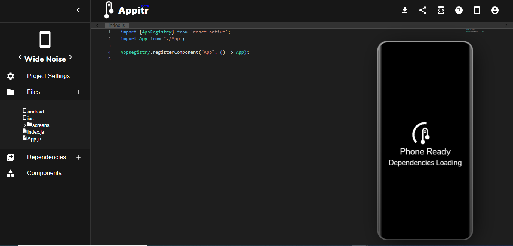

### A propos : 
Il s'agit d'une application mobile de _don du sang_ 

---- 
### Guide de configuration pour les contributeurs : 
##### Configuration
Pour la création de votre projet, vous pouvez utiliser Expo CLI ou React Native CLI.
- Expo CLI : ceci demande moins de configuration, il suffit d'installer Node.js et expo-cli 
  - pour node.js : suivez ce lien [Node LTS](https://nodejs.org/en/download/) 
  - pour expo-cli : 
    > npm install -g expo-cli
  - Lancement de l'application : veuillez installer l'application mobile du client Expo sur PlayStore ou AppStore et connectez vous à la même ligne de connexion puis utilisez l'application Expo pour scaner le code QR dans votre terminal.
  Beaucoup plus des détails sur le site [d'Expo ici](https://docs.expo.io/)
- React Native CLI : 
  - Windows :
    - Installez Node, Python2, JDK : c'est recommandé d'utiliser le package manager de windows [choco](https://chocolatey.org/)
      ouvrez le terminal en tant qu'admin puis tapez :  
      > choco install -y nodejs.install python2 jdk8
    - Installez Android Studio : dans l'installation il faut selectionner le choix : "Custom" pour le type d'installation puis cocher la liste suivant : 
      > - Android SDK
      > - Android SDK Platform
      > - Performance (Intel ® HAXM)
      > - Android Virtual Device
      puis cliquez _Next_ pour confirmer l'installation de ces packages.
    - Ajoutez les variables d'environnement : 
      Allez vers _System and Security_ dans votre paneau de configuration, puis cliquez _Change settings_, ansi _Advanced_ puis cliquez _Environement Variables_, cliquez _New_ afin de créer une variable ANDROID_HOME comme dans l'image 
      Généralement vous pouvez trouver le chemin ici : 
      > c:\Users\YOUR_USERNAME\AppData\Local\Android\Sdk

      Puis ajoutez le chemin de _platform-tools_ au chemin global : 
       System and Security -> Change settings -> Advanced -> Environment Variables -> Path -> Edit , puis cliquez _New_ et ajoutez le chemin convenable, généralement c'est ici : c:\Users\YOUR_USERNAME\AppData\Local\Android\Sdk\platform-tools

##### Simulateurs et IDEs enligne : 
- Expo Snack :

C'est un IDE intégré enligne 

Dans la partie à droite, vous trouvez les quatre possiblités de visualisation ou disons de simulations; web, android, ios, ou sur votre portable en scannat le code QR, ci-dessous un exemple avec IOS :

Et avec le web : 

Il contient beaucoup plus des options et fonctionnalités veuillez les découvrir :) 

- Appitr : 

C'est un autre IDE bien joli et contient de plus l'option directe d'ajout des packages comme NativeBase par exemple, tandis que dans Snack Expo afin que vous ajoutez un package il faut d'abord ajouter ça dans package.json puis l'IDE vas démarrer l'installation c'est une façon indirecte

---

### Macro-fonctionnalités : 
#### pour comprendre la catégorisation : 
- Couleur rouge (_must to have_) : ça concerne les fonctionnalités de base vraiment indispensables
- Couleur jaune (_should have_) : cette priorité vient juste après, elle concerne les fonctionnalités à avoir mais pas trop indispensables au fonctionnement de l'application.
- Couleur verte (_nice to have_) : cette couleur représente les fonctionnalités auxiliaires mais optionnelles dans l'évolution des versions.
#### Fonctionnalités : 
Ces fonctionnalités seront détaillées après par des work-flows.

- Portée générale d'un user X : 

- Gestion de compte : 

- Gestion d'annonces : 

- Gestion des RDVs : 

- Satisfaction de l'utilisateur : 

- Pré-don du sang : 

- Post-don du sang : 

- Gestion bon du sang : 

