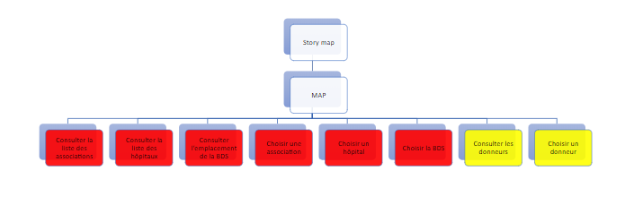
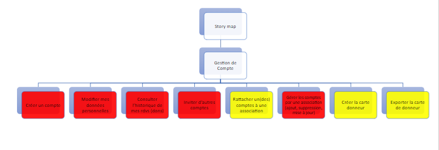
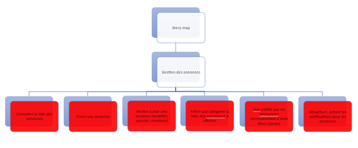
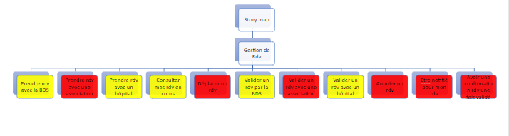
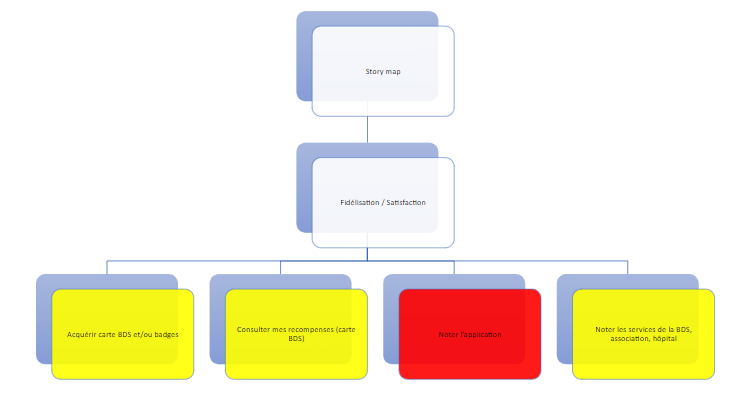
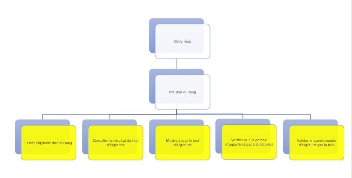
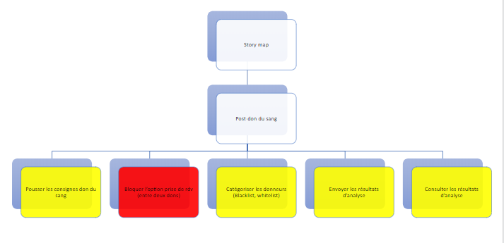
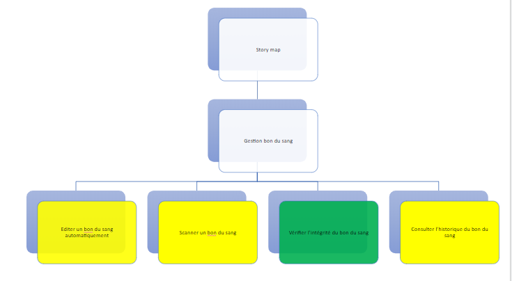
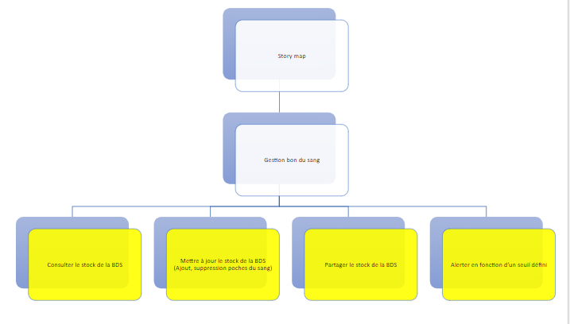

### A propos : 

  

Il s'agit d'une application mobile de _don du sang_ 

---- 
#### Guide de configuration pour les contributeurs : 
[Visitez la Note ici](https://www.evernote.com/shard/s447/sh/c016f3cd-b205-9843-5623-f9dd62a4edb4/4762d565b85b2bc0567f205fe16e3d7a)

#### pour comprendre la catégorisation : 
- Couleur rouge (_must to have_) : ça concerne les fonctionnalités de base vraiment indispensables
- Couleur jaune (_should have_) : cette priorité vient juste après, elle concerne les fonctionnalités à avoir mais pas trop indispensables au fonctionnement de l'application.
- Couleur verte (_nice to have_) : cette couleur représente les fonctionnalités auxiliaires mais optionnelles dans l'évolution des versions.
#### Fonctionnalités : 
Ces fonctionnalités seront détaillées après par des work-flows.

- Portée générale d'un user X : 

- Gestion de compte : 

- Gestion d'annonces : 

- Gestion des RDVs : 

- Satisfaction de l'utilisateur : 

- Pré-don du sang : 

- Post-don du sang : 

- Gestion bon du sang : 

#### Pour une Performance meilleure : 
- veuillez désactiver le mode **JS Dev Mode** : veuillez faire un shake de votre portable, selectionnez "settings" puis décochez "JS Dev Mode"
- l'application sera par la suite déployée en mode production qui augmente bien la performance

#### Screen-shots : 
